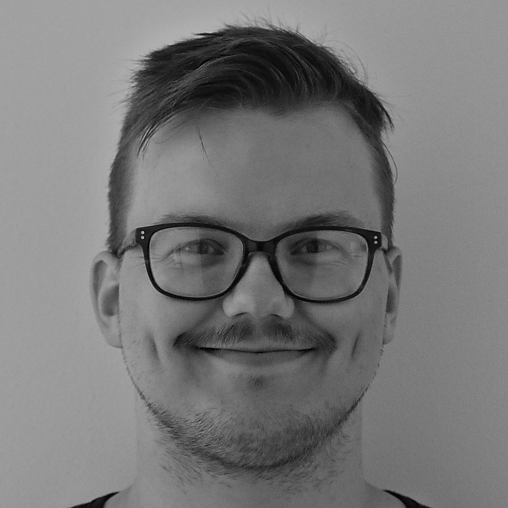

# About me

I'm a C++ and Go programmer. 

I studied theoretical physics at the University of Glasgow,
graduating with a BSc degree in 2016.

Currently I'm a student at the University of Oulu, enrolled in a MSc programme in Computer Science.

I've worked for a software company called FARA in the Public Transport sector since 2017.

My github profile right now has a couple of Go projects which I wrote for fun.

One of my hobbies is sports photography and I have a website where I post my pics: [lh.pic.fi](https://lh.pic.fi/kuvat)
